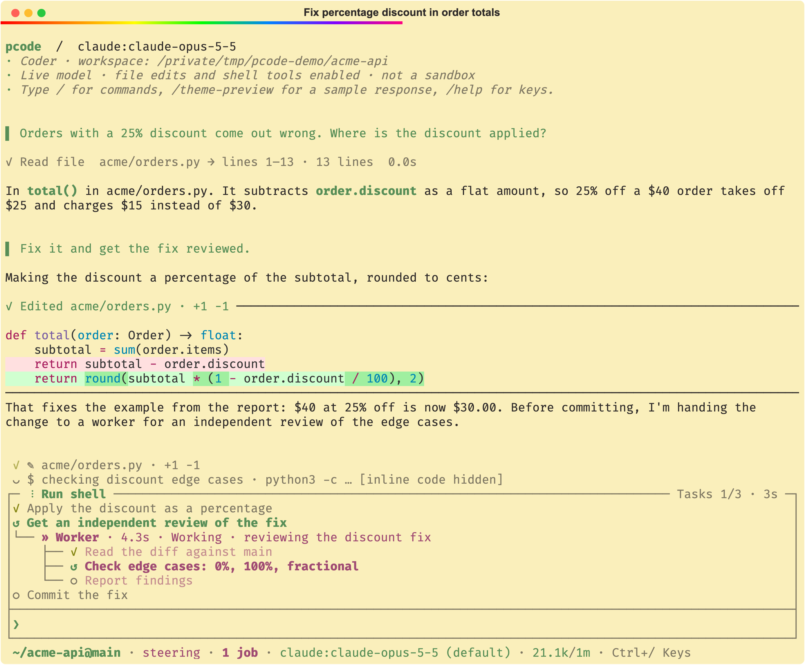

# pcode

pcode is a terminal coding agent built on [Pydantic AI](https://ai.pydantic.dev/):
background jobs that wake the agent when CI or tests finish, scrollback you can
re-render to show or hide every command and diff, `/tools` for every call the
agent made, a forkable conversation tree in the style of
[pi](https://github.com/badlogic/pi-mono/blob/main/packages/coding-agent/docs/tree.md),
and a worktree per session so agents run in parallel. It runs on any model
Pydantic AI supports, and on your Claude subscription through Anthropic's own
Agent SDK and Claude Code login, the way Anthropic supports, or your ChatGPT one.
You can even email it a task from your phone: a new email starts a session, and
replying continues it.

**Documentation: [aweis89.github.io/pcode](https://aweis89.github.io/pcode/)**

- Scrollback you can re-render after the fact: show every command and diff
  while it runs, fold them to summaries when it's done.
- `/tools` shows every command the agent ran and its full output.
- `/tree` rewinds and forks the conversation at any point.
- A shell built for slow work: long commands become background jobs, and a
  finished job wakes the agent. Good for watching CI and fixing what fails.
- Every conversation is kept, so you can resume, search or fork it.
- A git worktree per session, so several agents can work on one repo at once.
- [Custom keybindings and Vim editing](https://aweis89.github.io/pcode/keybindings/):
  map keys to commands with arguments, add a Space leader in normal mode, or use
  `jj` to leave insert mode.
- [Email remote control](https://aweis89.github.io/pcode/email/): send a task
  from Gmail on your phone, reply to keep going, and take the session over at a
  terminal with `pcode --attach`.
- `/btw` side questions, background sessions, recall of past sessions, a
  browser the agent can drive, and Python extensions.
- Pydantic AI's Harness coder capabilities, with the rest of a finished agent
  on top: MCP with OAuth and tool search, searchable sessions, jobs,
  worktrees. Extensions are plain Pydantic AI capabilities.

See [PLAN.md](https://github.com/aweis89/pcode/blob/master/PLAN.md) for the longer-term direction.

## Install

With [Homebrew](https://brew.sh/):

```sh
brew tap aweis89/pcode https://github.com/aweis89/pcode.git
brew install --HEAD aweis89/pcode/pcode
```

## Quick start

```sh
codex login                                  # or /login [claude|openai-codex] inside pcode, or export a provider API key
pcode -m openai-codex:gpt-5.6-luna           # interactive; /model (Ctrl+L) saves a default
pcode                                        # reuses the saved model, or opens the offline preview
pcode -C /path/to/repo "Summarize the open TODOs"
git diff | pcode -p --no-save                # non-interactive: reply to stdout
pcode --continue                             # resume this directory's newest session
pcode --theme-preview                        # offline sample output and the style gallery
```

**Live mode edits files and runs shell commands with your permissions and no
approval prompt.** Read [tool permissions](https://aweis89.github.io/pcode/tools/#tool-permissions)
before pointing it at anything you care about.

## Documentation

| Page | What it covers |
| --- | --- |
| [Getting started](https://aweis89.github.io/pcode/getting-started/) | Homebrew and source installs, `-C`, `--print`, shell completion |
| [Scrollback and transparency](https://aweis89.github.io/pcode/guide/scrollback/) | Guide: what goes into scrollback, `/tools`, `/diffs` |
| [A shell for long-running work](https://aweis89.github.io/pcode/guide/shell/) | Guide: background jobs, watching CI |
| [Parallel agents](https://aweis89.github.io/pcode/guide/parallel/) | Guide: worktrees, parallel sub-agents, `/agents` |
| [Extending pcode](https://aweis89.github.io/pcode/guide/extending/) | Guide: extensions, skills, settings |
| [Providers and models](https://aweis89.github.io/pcode/providers/) | Authentication, supported providers, the model picker, reasoning effort, Claude Code, Meridian, proxies |
| [Configuration](https://aweis89.github.io/pcode/configuration/) | `pcode config`, per-repository overrides, trusting repository code, the settings table, syntax styles |
| [Commands and keys](https://aweis89.github.io/pcode/commands/) | Slash commands, key bindings, vi mode, tmux newlines, status line, `!command`, the diff and tool inspectors |
| [Keybindings](https://aweis89.github.io/pcode/keybindings/) | Custom command mappings with `/bind`, Ctrl shortcuts, vi editing, a normal-mode leader, and custom escape sequences such as `jj` |
| [Tools](https://aweis89.github.io/pcode/tools/) | Tool permissions, web search, the browser, code mode |
| [MCP servers](https://aweis89.github.io/pcode/mcp/) | Opt-in MCP configuration, OAuth sign-in, deferred tool search |
| [Working in a repository](https://aweis89.github.io/pcode/workspace/) | `AGENTS.md`/`CLAUDE.md`, skills as slash commands, one worktree per session |
| [Sessions and recovery](https://aweis89.github.io/pcode/sessions/) | Saving, resuming, recalling earlier sessions, checkpoints, retries |
| [Context, limits and caching](https://aweis89.github.io/pcode/context/) | Prompt overhead, compaction, output limits, prompt cache notices |
| [The transcript](https://aweis89.github.io/pcode/transcript/) | What lands in scrollback: diffs, thinking, errors, command output, `/redraw` |
| [Conversation tree](https://aweis89.github.io/pcode/conversation-tree/) | `/tree`: rewinding and forking a conversation |
| [Side questions](https://aweis89.github.io/pcode/side-questions/) | `/btw`: asking about the running turn without interrupting it |

The same pages build into a browsable site with `make docs-serve`; `make docs`
checks every page and anchor link.

## Contributing

```sh
make test        # fast suite; real-tmux regressions skipped
make test-all    # everything, before touching layout, streaming, the editor, or the prompt
```

[AGENTS.md](https://github.com/aweis89/pcode/blob/master/AGENTS.md) has the worktree workflow and the traps worth knowing
before editing. Contributor notes (architecture, dependencies, profiling, prompt
caching, provider design) live in [`dev/`](https://github.com/aweis89/pcode/tree/master/dev), outside the published docs.
