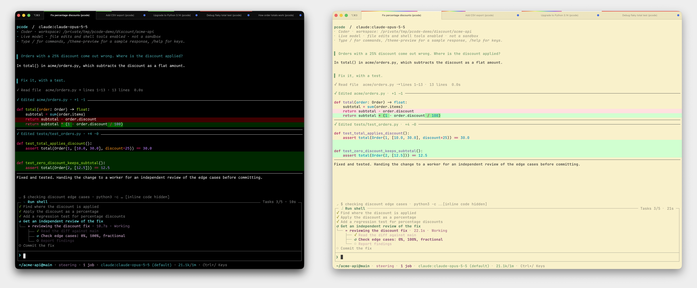

# Soft-launch post

## Suggested title

I built a terminal coding agent for myself. Curious whether anyone else wants the same things.

## Body

I’ve been building pcode, a terminal coding agent on Pydantic AI. I’m obviously biased, but it’s become my favorite way to work. I built it around my own preferences, so I’m curious whether they translate to anyone else.

One feature I particularly like: you can change what’s visible in your terminal scrollback, even after the work is done. Show commands, output, and diffs when you want the details, then hide them to read the conversation. It rebuilds the history already on screen without rerunning anything.

It uses your terminal’s native scrollback, so normal scrolling, search, and copy still work. The transcript reflows when you resize or split panes, it follows your terminal between dark and light themes in auto mode, and a live task panel keeps ongoing work visible above the prompt.

It’s also highly extensible: small Python files can add tools, slash commands, guardrails, and sub-agents, and /reload picks up changes without restarting.

There’s quite a bit built in: a pi-inspired /tree for rewinding and branching conversations, customizable keybindings (including leader keys), Vim editing mode, and a /diffs popup for reviewing git diffs without leaving the conversation. Background commands wake the agent when they finish, and separate git worktrees let you run sessions in parallel.

Repo, screenshots, and install instructions: https://github.com/cruxwell/pcode

If you already use a terminal coding agent, I’d love some blunt feedback. What would make this worth trying, and what’s missing?

## Posting history

- October 8, 2026: published and revised as a comment in r/ChatGPTCoding’s weekly self-promotion thread, with the dark and light screenshots combined side by side. The suggested title was not used for the comment.
  https://www.reddit.com/r/ChatGPTCoding/comments/1wy2qk8/comment/peq7l5h/
