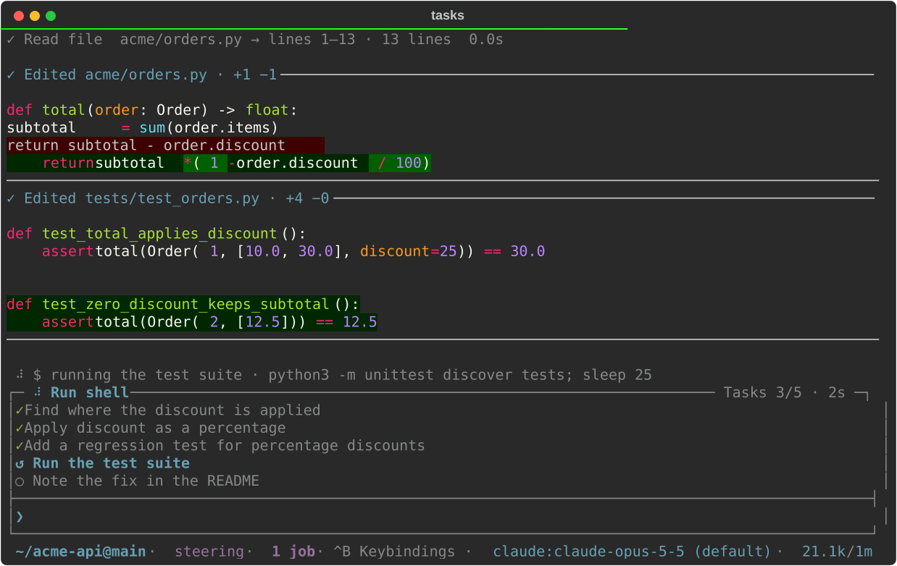

# Commands and keys

## Slash commands

Type `/` to open the command menu, then narrow it by typing. Use Tab or the
arrow keys to choose. Enter accepts a selected completion; another Enter runs it.

- `/help` (or `/commands`): grouped command list and keyboard shortcuts.
- `/login [claude|openai-codex]`: sign in in a browser. `claude` (the default) runs
  `claude auth login` for the login `claude:` models use ([details](providers.md#signing-in));
  `openai-codex` uses Pydantic AI's OAuth flow (no CLI required). pcode's own Anthropic
  sign-in and Meridian are [turned off](providers.md#sign-in-with-your-anthropic-account).
  `/logout [anthropic|openai-codex]` removes pcode's stored login, leaving CLI credentials
  untouched. Both require an idle conversation.
- `/model`: searchable model picker for configured providers. Keeps the conversation;
  chosen mid-run, it applies from the next request. To switch for one prompt only, start
  it with `$PROVIDER:MODEL` (optionally `+EFFORT`, as in `$openai:gpt-5+high fix this`)
  or a bare `+EFFORT` word; that turn runs there and the next prompt is back on the
  conversation's model. `$` completes model names as it does in `/btw`. A `$` word
  without a lowercase `provider:` part (`$HOME`) or an unknown `+` level is ordinary
  text. Another model starts without the conversation's prompt cache, and automatic
  compaction is skipped for its turn, since that model's window and summarizer would
  decide what the conversation keeps. Such a prompt never steers a running turn; it
  queues as its own. `/resend` of it asks the conversation's model.
- `/subagents [MODEL ...|off]`: the models `delegate_task` suggests for running a sub-agent (any other `provider:model` also works); each
  word completes from the `/model` catalog. Bare lists them, `off` clears them
  ([details](tools.md#sub-agents-on-other-models)).
- `/tools`: the [tool-call inspector](#tool-call-inspector) for the current conversation,
  including resumed calls. `/tools failed` opens it filtered to failures.
- `/diffs`: review the session's work as a git diff, one entry per file, in a
  full-screen popup (see [Diff browser](#diff-browser)).
- `/links`: pick a URL from the active conversation branch: your prompts, tool
  arguments and results, or the assistant's replies, most recent first. Duplicate
  URLs appear once, at their latest position; tool links show the tool name.
  The picker opens in its search line: typing filters URLs, labels, and sources
  (case-insensitive) while `↑`/`↓` move the selection, and Tab moves to the list.
  `Enter` opens the URL in the default browser (`open` on macOS, `xdg-open` on
  Linux, the shell association on Windows). `Esc` clears the search, or closes the
  picker when the search is empty. **Ctrl+B `t`** shows/hides tool links (shown by
  default; URLs also in prompts or replies stay) and **Ctrl+B `f`** returns to the
  search. Filters reset when you reopen it. Output dropped by truncation or stored
  only in a spill file isn't searched. Handy when your terminal or tmux doesn't
  make links clickable.
- `/copy`: copy the last response to the system clipboard. A quote renders with a
  `▌` rail and wraps to the terminal, which makes it awkward to select by hand, so
  when the response holds quotes or fenced code blocks a picker lists each one
  (without its `>` markers) beside the whole response. Enter copies the selection.
  pcode asks the model to put text meant for pasting elsewhere, such as a message
  to send, in a quote. **Ctrl+B `y`** with an empty editor does the same.
- `/status`: current model, workspace, session storage path, completed turns, token usage,
  and a breakdown of the prompt overhead re-sent with every request (see
  [Where the fixed prompt goes](context.md#where-the-fixed-prompt-goes)). Opens a popup in
  the interactive editor; prints inline otherwise.
- `/usage`: plan limits and spend for the Claude Code and Codex logins, fetched when you
  run it. Subscription seats show the session (5h) and weekly percentages with their resets,
  including per-model weekly caps. Seats billed at API rates show monthly spend against
  its cap (for example `Spend: $652.42 of $2,500.00 (26%)`). No admin key is needed: Claude
  reads the login of the current `CLAUDE_CONFIG_DIR` (from the Keychain on macOS, else
  `.credentials.json`), and Codex uses pcode's `/login openai-codex` or the Codex CLI's
  `auth.json`, through `PCODE_LLM_PROXY` when set. Both endpoints are undocumented and can
  change. An expired Claude Code token is reported, never refreshed, so Claude Code stays
  signed in. Plain API keys have no per-user usage endpoint and aren't covered.
- `/resend`: retry from the last checkpoint without a new message; shows the previous
  prompt and spinner.
- `/jobs [stop ID|stop all|watch ID|unwatch]`: bare `/jobs` opens a popup listing this
  session's shell jobs, running first, beside the selected job's command and live output.
  **Ctrl+B `w`** pins or unpins its output tail in the command preview, **Ctrl+B `k`** stops it,
  and Enter/Esc closes. The subcommands do the same without the popup. Jobs outlive the
  turn that started them; see [Shell jobs](tools.md#shell-jobs).
- `/compact [focus]`: summarize older context with the current model; keep recent history.
- `/autocompact on|off|TOKENS|auto`: toggle automatic compaction (saved; default on).
  `/autocompact 200k` compacts once context reaches 200k tokens even if the window is
  larger (minimum 50k), and the footer shows usage against that cap; `auto` removes
  the cap. Works mid-turn, from the next model request.
- `/new`: start a new saved conversation; clears the screen and retained scrollback,
  keeps input history.
- `/resume`: browse and search saved conversations by their prompts; resume one in place.
- `/switch [HOST | - | new [PROMPT]]`: pick another running
  [background session](sessions.md#background-sessions) and show it here, or start a new
  one; the session you leave keeps working.
- `/restart`: restart this background session's host on the pcode installed now, keeping
  the conversation.
- `/stop`: end this background session's host and quit. Quitting any other way (Ctrl+D,
  `/quit`) does the same.
- `/detach`: quit but leave this background session's host running; `pcode --attach`
  returns to it.
- `/tree`: [browse and fork the conversation](conversation-tree.md); select a user prompt
  to edit it, or an assistant response to continue from there. Existing branches are kept.
  Browsable at any time; forking waits for the running turn.
- `/btw QUESTION` (alias `/side`): [ask a side question](side-questions.md) against the context the model
  is working with right now, without interrupting or queueing it. The answer opens in a
  popup when ready (`btw_auto_open`); bare `/btw` opens the answers at any time. There,
  **Ctrl+B `r`** [asks a follow-up](side-questions.md#following-up), **Ctrl+B `y`** and **Ctrl+B `o`**
  copy and open links as `/copy` and `/links` do, and **Ctrl+B `s`** and
  **Ctrl+B `t`** [keep a thread](side-questions.md#keeping-a-thread) as a summary or a merged
  `/tree` branch. `/btw $PROVIDER:MODEL [$PROVIDER:MODEL ...] QUESTION` asks other models
  instead, one side question each ([choosing the model](side-questions.md#choosing-the-model)).
  A `+EFFORT` suffix (`$openai:gpt-5+high`), or a bare `+EFFORT` word for the
  conversation's model, sets that question's reasoning effort from the `/effort` levels.
- `/workers`: follow delegated workers live in a read-only popup: each worker's
  assignment, plan, prose, and tool calls, which the transcript only summarizes. Works
  while the turn runs. **Ctrl+B `t`** shows or hides reasoning. Workers are kept in memory
  only, so a resumed session starts with none.
- `/skill:NAME [text]`: run a discovered skill; see
  [Skills as slash commands](workspace.md#skills-as-slash-commands).
- `/theme light`, `/theme dark`, `/theme auto`: change the input and future output
  palette; bare `/theme` toggles. Auto (the built-in default) detects the terminal
  background at startup, falling back to `COLORFGBG`, then dark (including for
  redirected output). A saved theme takes precedence. Restart pcode after changing your
  terminal background. `pcode config set theme auto` also restores auto mode, and
  `pcode --theme light|dark|auto` picks the palette for one launch. The
  palette decides which `/syntax` setting applies (`syntax_dark` or `syntax_light`);
  body text and background stay terminal-native either way.
- `/syntax NAME`: choose colors for the active palette and save them as its default;
  bare `/syntax` reports the current choice. `/syntax terminal` is the default:
  scrollback, fenced code, the prompt, task rows, and menus all use the terminal's own
  ANSI colors, so pcode follows your terminal's scheme. Any Pygments style
  (`/syntax gruvbox-dark`, `/syntax monokai`) switches to pcode's own colors: headings,
  links, quotes, and tables use the palette, and code, popups, and prompt are derived
  from the style. See [Code highlighting styles](configuration.md#code-highlighting-styles).
  Retained scrollback is rebuilt with the new colors, like `/redraw`.
- `/theme-preview`: sample Markdown, code, diffs, tables, and tool summaries, then a
  gallery of every installed Pygments style (current one marked) with the command that
  selects it. Never calls the model and isn't added to the conversation.
  `pcode --theme-preview` (formerly `--demo`, still accepted) prints the same and exits.
- `/redraw`: rebuild the transcript at the current width; see
  [Regenerating the terminal transcript](transcript.md#regenerating-the-terminal-transcript).
- `/quit` (alias `/exit`): exit. It cancels a running turn and waits for its cleanup first.

Toggles such as `/show-thinking`, `/show-tasks`, `/show-edits`, `/show-commands`,
`/group-tools`, and `/autohide-tasks` are described with the features they control,
on this page and in [the transcript](transcript.md).

Popups (sessions, conversation tree, models, tools) use the terminal's default
background and text with reverse-video selection, whatever `/theme` and `/syntax`
say. Opening a popup cancels popup requests already waiting, so pressing Ctrl+B `l`
twice quickly opens one picker, not a second after you close the first. Queued
messages and other commands are unaffected, and asking again after closing opens
the popup normally.

### File references with `@`

Type `@` anywhere in a prompt to reference a workspace file. The menu matches any
part of the path, so `@ui.py` finds `src/pcode/ui.py`; files whose name matches
come first, and each row shows the file's size. Accepting a match inserts the
workspace-relative path, `./src/pcode/ui.py`, which is what the model's file tools
take (names with spaces are quoted). References are underlined in the editor.

Only the path is sent. pcode never reads the file for you, so the model decides
whether reading it is worth a call; the size in the menu shows that cost up front.

In a Git checkout, candidates are tracked plus untracked files, honoring
`.gitignore`. Elsewhere they come from ripgrep (skipping hidden entries, honoring
`.ignore`, and excluding build directories such as `node_modules`), or a plain
directory walk when ripgrep isn't installed. The list refreshes at most every ten
seconds, so a brand-new file can take a moment to appear.

## Keys and layout

Actions that pick a mode, open a picker, or toggle a widget follow the
[shortcut prefix](#shortcut-prefix): by default, press Ctrl+B and then the
letter. F1 browses contextual help without running an action. Enter, the
arrows, Ctrl+J, Ctrl+C, and Ctrl+D never change.

| Key | Action |
| --- | --- |
| Enter | Send using the active send mode, or accept a selected completion |
| F1 | Browse contextual help |
| Ctrl+B | Open the contextual action menu |
| Ctrl+B `s` | Cycle steering → queue → interrupt for the next send only |
| ↓ | Newline when on the last line with nothing to complete or recall (works in vi insert mode) |
| Ctrl+J / Shift+Enter | Newline; see [Newlines in tmux](#newlines-in-tmux) if neither reaches pcode |
| Alt+Enter | Newline in Emacs mode only (Esc followed by Enter also works) |
| Tab / arrows | Browse completion; arrows also navigate input/history |
| Ctrl+B `l` | Choose a model (keeps the conversation; applies from the next request) |
| Ctrl+B `n` / Ctrl+B `p` | Raise / lower reasoning effort for the next turn |
| Ctrl+B `^` | Back to the session this terminal showed before (`/switch -`) |
| Ctrl+B `o` | Show/hide the Tasks/Tools widget (saves the default) |
| Ctrl+B `t` | Choose where thinking shows: `o` off, `s` status line, `b` scrollback (saves the default) |
| Ctrl+B `y` | Copy the current draft to the system clipboard (collapsed pastes are expanded first); with an empty editor, `/copy` the last response |
| Ctrl+B `g` | Mirror commands and their output to scrollback (saves the default) |
| Ctrl+C | Discard input; cancels the running turn only when the prompt is empty |
| Ctrl+D | Exit on empty idle input (stopping a background session's host); cancel during generation |

Terminal flow control is off while the prompt is active. There is no
incremental history search at the prompt. With `key_prefix ctrl`, Ctrl+S
cycles send mode and Ctrl+O replaces the editor's insert-newline binding;
Ctrl+J still inserts a newline.

**Ctrl+B `y`** copies whatever is in the editor, so you can move a draft elsewhere
without sending it. A collapsed paste marker is expanded first, so the clipboard
gets exactly what Enter would send. In direct chord mode only, this replaces
`yank` in Emacs mode and copy-character-from-above in vi insert mode. With
nothing typed it runs `/copy` instead, to copy the last response or a quote
from it. Copying uses a local helper (`pbcopy`, `wl-copy`,
`xclip`) or OSC 52 over ssh, like the popups, and truncates at 64 KiB.

Delegated sub-agents are listed in the widget beneath your active task while
they run. A finished one leaves the widget; its outcome shows briefly on the
status row and stays in the transcript.

`/autohide-tasks on` (or `pcode config set autohide_tasks on`) hides the widget
as soon as the model finishes a turn, keeping the idle prompt compact; it
returns on the next turn, and Ctrl+B `o` brings it back immediately. Default: off.

The widget sits at the top of the editor box by default (`attach_tasks=on`):
its heading becomes the editor's top border and a divider separates the tasks
from your draft. Queued prompts sit above the combined box. Use
`/config set attach_tasks off` to draw it in a separate box above the editor,
or `/config set attach_tasks on` to attach it again. Both apply immediately
and save the preference; `pcode config set attach_tasks off` sets it from the shell.

`pcode config set tasks_max_height 0.5` caps the widget and the editor box
together at half the screen; a whole number such as `20` caps them at that many
rows instead. The tasks get the room first and the editor keeps at least one
text row, so a long plan lists more of its steps while a long draft scrolls
inside the editor. Unset (the default), the widget stays at no more than 10 rows
or half the screen, whichever is smaller, and the editor grows into whatever is left.

**Ctrl+B `y`** copies whatever is in the editor right now, so a draft can be moved
somewhere else without sending it. A collapsed paste marker is expanded first:
what lands on the clipboard is what Enter would send. In direct chord mode
only, this replaces `yank` in Emacs editing mode and copy-character-from-above
in vi insert mode. With nothing typed it runs
`/copy` instead, to copy the last response or a quote from it. Copying uses a
local helper (`pbcopy`, `wl-copy`, `xclip`) or OSC 52 over ssh, the same as the
popups, and truncates at 64 KiB.

**Setting acknowledgements are transient.** Toggles and display settings
(`/show-thinking`, `/show-tasks`, `/show-edits`, `/show-commands`,
`/group-tools`, `/autohide-tasks`, `/autocompact`, `/theme`, `/syntax`,
`/effort`) answer on a line just above the editor and clear after five seconds.
They never enter scrollback, so flipping an option repeatedly doesn't litter the
transcript. Long acknowledgements wrap and are capped at six rows. Everything
else a command reports (`/status`, `/mcp`, `/help`, login flows, session and
model changes, warnings, errors) goes to scrollback. Without a live panel
(redirected output, `--print`), acknowledgements are printed instead.

### The editor

The input sits at the bottom of the pane from startup: one line plus its border.
It grows upward for wrapped text or newlines and shrinks as text is removed.
Completions appear above it. Very long input scrolls within the available
height. Multiline bracketed paste works; mouse capture is off.

Wrapping is word-aware: a word that would straddle the right edge moves to the
next row whole. This is display only; the text you send is unchanged. A single
word wider than the pane still has to split.

The editor stays usable while the model works, including multiline input,
history, slash completion, and `@` references. See
[Sending while the agent is working](#sending-while-the-agent-is-working).
Editor history is kept in memory only.

## Tasks/Tools widget

Tasks and running sub-agents share one compact widget above the editor. Task
rows show status icons and keep the active item in view. Running
[sub-agents](#delegated-sub-agents) appear beneath the active task with tree
guides (`├──`, `└──`, `│`); with no active task, they appear unparented.
Tool calls never get rows here: most finish in milliseconds, so rows for them
would flicker in and out. The status row follows thoughts, notices, and side
questions, directly above command previews, tasks, and the editor. It names the
newest running call and counts the rest (`Running 3 tools`). A finished call
gets its line in [scrollback](transcript.md).



The status row always reads the same way: a spinner, what the turn is doing,
what it is doing it to, and on the right the run's tool count and how long
this phase has lasted.

```text
  Tracing the resize path
◜ Thinking                                                    8s
◜ Edit file · src/app.py                        ✓7 ✗1 tools · 2s
◜ Waiting for model · ✓ Read file · src/app.py     ✓8 tools · 0s
◜ ◈ Compacting context ▸ keep tests                           4s
```

A spinner means the turn is waiting on that row. Running jobs are counted in
the footer below the editor as `1 job` or `N jobs`, including jobs being waited
on; the count is hidden at zero. Use `/jobs` for individual job details.
The phase is the one highlighted word, and a stall shows as its clock climbing
(`Thinking · 40s`). A call that just finished stays for a
moment, marked `✓` or `✗`, so a burst of quick calls reads as progress rather
than flicker. `◈` marks work pcode runs itself, such as compaction.
Faded, indented rows above the status row show the model's newest thoughts, up
to three of them, kept until the turn ends; that is the default
`/show-thinking status-line` mode (see
[thinking](transcript.md#thinking-status-line-or-scrollback)).

Press **Ctrl+B `o`** or use `/show-tasks [on|off]` to hide or show the widget without
stopping work or clearing tasks. The prompt and queue stay visible. Visibility
is saved (default on); `pcode config set show_tasks off` sets it from the shell.

`/autohide-tasks on` (or `pcode config set autohide_tasks on`) hides the widget
when the model finishes a turn, keeping the idle prompt compact. It returns on
the next turn, and Ctrl+B `o` brings it back immediately. Default off.

By default the widget is attached to the top of the editor box
(`attach_tasks=on`): its heading becomes the editor's top border, with a divider
between tasks and your draft. Queued prompts sit above the combined box.
`/config set attach_tasks off` draws it in a separate box above the editor, and
`/config set attach_tasks on` attaches it again. Both apply immediately and save
the preference; `pcode config set attach_tasks off` works from the shell.

`pcode config set tasks_max_height 0.5` caps the widget and editor together at
half the screen; a whole number such as `20` caps them at that many rows. Tasks
get the room first and the editor keeps at least one text row, so a long plan
shows more steps while a long draft scrolls inside the editor. Unset (the
default), the widget takes at most 10 rows or half the screen, whichever is
smaller, and the editor grows into what's left. In small panes the widget
shrinks further, keeping the active task and its sub-agents; an empty widget is
hidden.

Task additions and status changes show up as soon as the model starts streaming
them, before the tool runs. Those early updates are provisional: the tool result
confirms them, and a cancellation or failure discards them. Only confirmed plans
are saved. Successful planning calls update the task rows without adding tool
rows; failed ones stay visible as failed calls. Plans persist across turns and
resumed sessions; `/new` clears them.

### Delegated sub-agents

A running `delegate_task` has its own row, starting with `✦` instead of a status
icon and drawn in its own color, so it never reads as one of your tasks. It
shows the agent, elapsed time, phase, and the purpose the model gave (or the
start of its assignment). The phase is `Waiting for model`, `Thinking`,
`Working` (one of its tools is running), or `Responding`. The row stays for the
sub-agent's whole run and leaves when it finishes; scrollback records whether it
was done or failed. While nothing else is running, the status row reads
`Waiting for 2 sub-agents`, and names the newest one when the widget is hidden.

A sub-agent that plans shows up to three of its tasks beneath it, centered on
its active task, and they update as it works. Its own tool calls show on the
status row, like yours, rather than in the tree. Its plan is
separate from yours: never saved and never merged into your plan, and it leaves
with the delegate. The built-in worker always plans; an extension's delegate can
opt in (see "Sub-agents" in pcode's extension guide).

```text
* Fix the flaky login test
└── ✦ Worker · 12.4s · Working · Investigate the retry path
    ├── ✓ Read the retry code
    ├── * Reproduce the failure
    └── ○ Report back
```

## Shortcut prefix

Every pcode shortcut is a letter behind one prefix, the `key_prefix` setting.
The default is **Ctrl+B**, followed by the plain action letter: Ctrl+B `s`
cycles the send mode, and Ctrl+B `l` opens the model picker. Release Ctrl
before pressing the letter, the way tmux's prefix works. Choose another
leader or restore direct Ctrl chords:

```sh
pcode config set key_prefix ctrl+p           # Ctrl+P, then s cycles the send mode
pcode config set key_prefix "ctrl+x ctrl+p"  # a leader of several keys, pressed in turn
pcode config set key_prefix ctrl             # direct Ctrl+S, Ctrl+L, etc.
pcode config unset key_prefix                # restore the default Ctrl+B leader
```

Press **F1** to browse contextual help for the prompt or the popup you are
using, including navigation, editing, and actions. The prompt and popups show
one compact help indicator rather than separate hints beside every control.

Press the leader to open the same help surface in action mode. A listed
letter runs its action; Esc dismisses the menu without changing your draft.
The leader works whatever has focus, including a popup's search line or the
`/btw` editor. In direct `ctrl` mode, F1 still lets you browse help without
running an action.

At the prompt the letters are `s` send mode, `l` model, `n`/`p` more/less
effort, `o` tasks widget, `t` thinking, `g` command output, `^` previous
session, and `y` copy the draft. Each popup lists its own in contextual help; see
[Popup keys](#popup-keys).

A leader takes over whatever its key did before: with `ctrl+p`, Ctrl+P no
longer moves up a line or lowers effort (that is now Ctrl+P `p`). The default
Ctrl+B likewise takes over Emacs's backward-character chord; use ← instead.
If tmux also uses Ctrl+B, send its prefix through to pcode or choose a different
pcode leader. Keys nothing
else uses make the least surprising leaders: `ctrl+space`, `ctrl+]`, `ctrl+\`,
or a function key such as `f2`. A leader is built from Ctrl+*key* (a letter,
space, `]`, `\`, `^`, or `_`) and F1–F24. Ctrl+C, Ctrl+D, Ctrl+H, Ctrl+I,
Ctrl+J, Ctrl+M, and Ctrl+[ are refused because terminals send them as
Backspace, Tab, Enter, and Esc, or pcode needs them everywhere. If you choose
F1 as the leader, it opens the action menu instead of browse-only help.

The prompt reads `key_prefix` at launch; popups read it as each one opens.

## Optional vi editing

The prompt uses Emacs-style editing by default. To use vi bindings from the next
launch:

```sh
pcode config set editing_mode vi
```

`/config set editing_mode vi` in a session works too, followed by a restart.
Restore the default with `pcode config set editing_mode emacs` or
`pcode config unset editing_mode`.

The editor starts in insert mode; Escape switches to normal mode, and `i` or `a`
resume inserting. `o` / `O` in normal mode open a line below / above. Standard vi
motions and editing commands work. Enter still submits (or accepts a selected
completion), and Ctrl+J inserts a newline. Escape takes priority in vi mode, so
Escape then Enter submits rather than inserting a newline; that's why Alt+Enter
is a newline only in Emacs mode. Other pcode shortcuts are unchanged.

Vi mode waits only 100 ms for a terminal escape sequence to complete, so Escape
enters normal mode without a noticeable pause. Very slow or laggy connections
may occasionally split an escape sequence.

**Shift+Enter inserts a newline** when your terminal sends a distinct CSI-u or
xterm modifyOtherKeys sequence for it. Ctrl+J works as the plain LF byte or
those extended encodings. If your terminal sends ordinary Enter for Shift+Enter,
pcode can't tell them apart: map Shift+Enter to send Ctrl+J (the single LF byte,
hex `0a`, often written `\x0a`) in your terminal's settings, and check it inside
tmux too if you use it. The ↓ key inserts a newline whenever it would otherwise
do nothing (last line, no completion menu, not browsing history), so it works
even where no chord gets through.

## Newlines in tmux

Inside tmux, Shift+Enter arriving as a plain Enter is almost always tmux, not
the terminal. Two things have to be true, and `extended-keys on` alone gives you
neither:

- tmux only asks the outer terminal for modified keys when its terminfo
  advertises `extkeys`; Ghostty's and kitty's do not, so declare it.
- `extended-keys on` forwards those keys only to apps that opted into the
  protocol themselves. pcode does not, so use `always`.

```tmux
set -as terminal-features ',xterm-ghostty:extkeys'
set -g extended-keys always
set -g extended-keys-format csi-u
```

Reload, then detach and reattach: tmux works out a client's features when it
connects. Check with `cat -v`: Shift+Enter should print `^[[13;2u`. If Ctrl+J
prints `^[[B` instead, a remapper (Karabiner, a Ghostty `keybind`) is turning it
into ↓ before tmux sees it; ↓ still inserts a newline on the last line, so that
is usually fine.

## Status line

The line below the editor shows the workspace/branch, the full `provider:model`
identifier, reasoning effort, and activity. Live models also show context, for
example `12.5k/200k` (tokens used / working window). Long paths shrink first,
and narrow terminals may cut off trailing details; send mode and working status
take priority over model and path.

Used context is the **latest completed request's input tokens**, including
cached input, not cumulative usage. It updates after each request, so it moves
during a long tool loop, and it follows the selected history when you resume or
switch branches. It doesn't include your draft, tool results not yet sent, or a
response still streaming. It shows `0` for an empty conversation or before usage
is reported. `/status` shows cumulative session input/output usage.

The working window is the same one compaction uses. pcode takes it from the
serving provider when it can (Codex's models endpoint or Anthropic's Models
API), otherwise from an exact provider/model match on
[Models.dev](https://models.dev/). Codex never borrows ordinary OpenAI API
limits, and custom proxies or Anthropic subscription logins don't inherit
direct-API limits. When separate input and total-context limits are known, the
smaller one is used. Public metadata is cached for 24 hours in
`$XDG_CACHE_HOME/pcode/model-context-v1.json` (default `~/.cache/pcode/`).
Unknown limits show `?`, so a first run offline can show `?`, and Codex needs a
successful lookup or an explicit override.

When a request reuses much less of the prompt cache than before, a muted note
such as `cache miss 0/166k` follows the context until your next prompt; see
[prompt cache notices](context.md#prompt-cache-notices).

## Sending while the agent is working

Enter uses the saved `send_mode` (default `steering`). **Ctrl+B `s`** cycles
`steering` → `queue` → `interrupt` for the *next* send only: the status bar
shows the picked mode with `(once)`, and the saved default returns as soon as a
prompt is sent. Messages already queued keep the mode they were sent with. Each
send clears the editor for another draft; the toolbar shows the mode and the
number of pending messages.

- **steering**: deliver input at the next model request, after active tools finish.
  A shell command the turn is waiting on doesn't hold that request back: the wait
  ends and hands the model a [job](tools.md#shell-jobs) handle, and the command
  keeps running. Pending input is labeled “Steering (next model request)”; once
  delivered, it replaces the active prompt in the task bar. If the turn finishes
  first, it's sent as a follow-up turn.
- **queue**: wait for the current turn to finish, then start a follow-up turn.
  Queued messages run in order.
- **interrupt**: cancel the current turn, discard pending messages, and send the
  new message once cancellation finishes. A shell command the turn was waiting on
  keeps running as a [job](tools.md#shell-jobs): you're redirecting the model,
  not cancelling its work. Ctrl+C does stop it.

Set the default with `pcode config set send_mode steering` (or `queue` /
`interrupt`); `/config set send_mode queue` changes it for the next launch.
Input sent while idle starts a normal turn in every mode.

Slash commands run separately from the model, so help, inspection, theme,
context, and effort commands work while it's busy. `/model` also works and
applies from the next request. `/new`, `/resume`, `/login`, and `/logout` need
an idle conversation: cancel or wait, then retry.

Cancelling:

- Ctrl+D cancels the current turn and clears queued messages, keeping your
  unsent draft and cursor.
- Ctrl+C discards the draft first, so cancelling with it takes a second press
  when the prompt has text. It also clears queued messages.
- A failed turn clears queued messages too, rather than running more requests.
  Queued slash commands are kept.
- The queue lives in memory until each message is sent.
- Cancelling never undoes tool effects that already happened. After a failed or
  cancelled run, the conversation resumes from the last settled point when safe.

## Running a command yourself: `!command`

A message starting with `!` runs the rest as a shell command in the agent's
working directory and environment, without asking the model anything:

```text
❯ !make test
```

Output streams into the live command panel while it runs and is mirrored to
scrollback when it ends (the last `command_scrollback_lines` rows). Ctrl+C kills
the command and its process group. There is no timeout.

The model hears about it with your next message, as if it had called the
`shell` tool itself: it sees the command and its output (plus `[exit code: N]`
when non-zero). Long output is handled like any tool result: over
`tool_output_threshold` characters it is stored behind a `read_tool_result`
handle with a `tool_output_preview_chars` preview, and the model reads only the
slices it needs. A `!command` typed during a turn waits in the queue whatever
the send mode, and nothing reaches the model until you send a message, so
`!make test` followed by `why did that fail?` is the usual pattern.

## Popup keys

Every full-screen popup (`/diffs`, `/tools`, `/links`, `/tree`, `/resume`,
`/btw`, `/status`, and the Ctrl+B `l` model picker) scrolls with the same keys,
acting on whichever pane has focus:

| Key | Action |
| --- | --- |
| ↑ / ↓ | Move the selection in a list, or scroll a text pane by a line |
| PageUp / PageDown | Move or scroll by a page |
| Ctrl+U / Ctrl+D | Move or scroll by half a page |
| Tab / Shift+Tab | Switch panes, where a popup has more than one |
| Esc / Ctrl+C | Close the popup and restore the editor draft |

Ctrl+D never closes a popup; it always half-pages. A list with a search line
keeps these keys working while you type, so the query stays where it is.

Popups with a search line (`/tools`, `/resume`, `/diffs`, `/links`) open with
the cursor in it, so you can type to filter straight away. Each popup's
shortcuts follow the [shortcut prefix](#shortcut-prefix) and act from any pane,
the search line and the `/btw` editor included, so typing never triggers one.
With the default prefix, press **Ctrl+B**, then the letter below. F1 shows
these actions alongside the current popup's navigation and editing keys:

| Popup | Shortcuts |
| --- | --- |
| `/btw` | `r` reply · `y` copy · `o` link · `s` summarize · `t` merge to `/tree` · `k` stop (or type `/copy`, `/links`, `/summarize`, `/merge`, `/stop` in the follow-up editor) |
| `/tools` | `f` search · `x` failures only · `t` tool filter · `y` copy command · `o` copy output |
| `/diffs` | `f` search the focused pane · `s` / `r` next / previous match · `v` next view |
| `/resume` | `f` search · `r` responses too · `g` all workspaces · `x` delete (twice) |
| `/switch` | `f` search · `n` new session · `x` stop (twice) |
| `/jobs` | `w` watch in the preview · `k` stop |
| `/links` | `f` search · `t` show/hide tool links |
| `/tree` | `y` copy the selection, or pick a quote or code block from a response |
| `/workers` | `t` thinking |

With `key_prefix ctrl`, use Ctrl+letter instead: Ctrl+Y copies.

Selected rows and scrollbars follow the active theme and syntax colors, like
completion menus; popup bodies keep the terminal's default background. With
terminal syntax colors, selections use reverse video and scrollbars use the
terminal's accent color.

Popups capture the mouse by default: clicks select rows and the wheel scrolls
whichever pane is under the pointer, but a plain drag no longer selects text.
Most terminals still select while you hold a modifier and drag (usually Shift;
Option in iTerm2). In tmux, mouse events reach pcode only with
`tmux set -g mouse on`.

**Ctrl+B `q`** (the [shortcut prefix](#shortcut-prefix) then `q`)
hands the mouse to the terminal while a popup stays open: a plain drag selects
text again, and the same shortcut once more takes clicks and the wheel back.
Contextual help says which it will do next ("Release mouse" or "Capture mouse"). It lasts until
the popup closes and works in every popup with shortcuts, from any pane, the
search line and the `/btw` editor included. In tmux with `mouse on`, a released
drag goes to tmux's copy mode instead; hold the modifier above for the
terminal's own selection. To leave the mouse to the
terminal in every popup instead, so a plain drag selects text and copy-on-select
works:

```sh
pcode config set popup_mouse off
```

Terminals with alternate scroll mode still turn the wheel into ↑/↓ then, moving
the selection or the pane a line at a time. The setting is read as each popup
opens, so no restart is needed.

## Diff browser

`/diffs` opens a full-screen popup with one net git diff per file, however many
times the file was edited, in the same colors as scrollback. The first line says
what is being compared. It opens on the session's net work:

- **In a linked worktree** (the default with `worktree on`): the whole branch
  against its merge-base with the mainline branch, including uncommitted and
  untracked files. That's what a merge would bring in, whichever tool made the
  change (file tools, the shell, a formatter, a worker). Merging mainline into
  the branch moves the merge-base, so mainline's own changes never show up.
- **In any other checkout**: everything since the commit the session started
  from, limited to files this session's file tools edited or its own commits
  touched, so work stays visible after the agent commits it. A commit counts as
  the session's when it was made after the session began by your git identity,
  so pulled commits are left out (without a `user.email`, only the time
  counts). Your own commits count too, including another session's in the
  same checkout, and a session resumed much later still compares against
  where it started. Those files show all their changes since the start,
  including ones you made by hand. Files changed through the shell
  appear once they're committed. If `HEAD` no longer descends from the start (a
  rebase or branch switch), or the session predates this, it falls back to
  uncommitted changes in edited files, and the title says so.

Ctrl+B `v` (the `v` shortcut) cycles to two more views:

- **Uncommitted**: what the next commit would take in, against `HEAD`. In a
  checkout other than a linked worktree, it's limited to the same session
  files.
- **Tool edits**: each edit the file tools made, newest first, including ones
  later reverted. Resumed and branched conversations show the edits of their
  own branch; nothing is re-read from disk or re-applied. Outside git this is
  the only view.

Each view loads the first time you show it. If the net view is empty, the
browser opens on the first view that isn't and says so. A switch keeps your
search, and stays on the selected file if the new view has it. When git can't
produce a view (no commits yet, a detached mainline), that view names the
reason.

Untracked files are included without touching your staging area. Untracked files
that look sensitive (`.env`, keys, credentials) are listed but never read, and
tracked ones show only their line counts. Secrets in other diffs are redacted as
in scrollback. A file's diff is clipped at 2,000 lines, and a file over 1 MB
shows only its counts.

The diff fills most of the screen, with a small file selector at the bottom.
Keys are listed in the header:

- The browser opens in the search line, searching paths (see Ctrl+B `f` below).
  Enter moves to the file list.
- Up/Down in the file list selects a file.
- Tab/Shift+Tab switch between the file list and the diff. The
  [popup keys](#popup-keys) act on whichever has focus; Ctrl+Home/Ctrl+End jump
  to the first or last line of the diff.
- **Ctrl+B `f`** searches whichever pane has focus. In the file list it filters
  files by path; in the diff it filters to changes with a matching line and
  jumps to the first one. Matching is fuzzy: a plain substring, or joined word
  prefixes such as `ed_ui` for `edit_ui.py` or `sel_row` for `selected_row`.
  Every word of the query must match. Up/Down still move the file selection
  while typing; Enter returns to the pane. Switching panes and pressing Ctrl+B `f`
  again starts a fresh query for that pane.
- **Ctrl+B `s`**/**Ctrl+B `r`** jump to the next/previous matching diff line (Emacs's
  search keys), from either pane or the search line.
- Escape or Ctrl+C closes the popup and restores the editor draft.

## Tool-call inspector

`/tools` (or `/tools failed`) opens a browser of every tool call in the current
conversation, including during a turn. It shows the calls available when you
open it; reopen it to see newer ones. The model keeps running while it's open,
and scrollback catches up when you close it. Inspecting never reruns a tool.

- Calls are newest first. The inspector opens in the search field, so typing
  filters straight away while arrows move the selection; Enter moves to the call
  list. Tab/Shift+Tab move between the search field, call list, and details.
- **Ctrl+B `y`** copies the selected call's command (or its whole arguments when it
  has no command) and **Ctrl+B `o`** copies its output. Copying uses
  `pbcopy`/`wl-copy`/`xclip` when installed and OSC 52 otherwise; over ssh it
  tries OSC 52 first. tmux passes OSC 52 through only with
  `tmux set -g set-clipboard on`. Copies are truncated at 64 KiB, and the header
  says what was copied or that copying failed.
- **Ctrl+B `x`** toggles failures only, **Ctrl+B `t`** cycles tool-name filters, and
  **Ctrl+B `f`** focuses search. Search matches tool names, statuses, and
  command/summary previews, not the full output. These work from any pane,
  including the search field.
- In details, arrows scroll by line, PageUp/PageDown by page, and Ctrl+U/Ctrl+D
  by half a page. Ctrl+U/Ctrl+D also half-page the call list, even while typing
  a search. The session browser uses the same keys.
- Mouse clicks and the wheel work unless `popup_mouse` is `off`; see
  [popup keys](#popup-keys).
- Escape or Ctrl+C closes the inspector and restores the editor draft.
- Wide terminals show calls and details side by side; narrow ones stack them.

Details include call and run IDs, timestamp and duration when captured,
structured arguments, outcome, and the returned output or error. Commands and
results are shown as blocks, highlighted when they're code or JSON and verbatim
otherwise. Shell commands are formatted as Bash with `shfmt` when it's on your
`PATH` (the command is never executed); otherwise pcode breaks one-line commands
at top-level `;`, `&&`, and `||` and keeps existing multiline layout. Each
command line starts with a display-only `$ `. **Ctrl+B `y`** still copies the
command exactly as run.

Nonzero exits, timeouts, and tool retries count as failures; interrupted calls
and unknown results are marked separately. Command tools show an **Execution**
row saying whether the model waited (`foreground`) or took a job handle
(`background`); background calls are tagged in the list, so searching
`background` finds them. Background launch, check, and stop calls show their
process ID and related calls when available. A successful launch doesn't mean
the process finished successfully.

Provider-run web searches (Anthropic's native `web_search`, used when the
`web_search` preference is `auto`) list each hit's title, URL, and age. The page
text arrives encrypted for the provider, so the inspector can't show it. Local
searches (Exa or DuckDuckGo) and `get_page` return plain text and show in full.

What the inspector shows is a redacted copy saved in the session's
`transcript.jsonl`, not an execution log. It survives resume and later failed
requests. Limits:

- Arguments and results are each capped at 128 Ki characters, with truncation
  markers. Output a tool had already truncated can't be recovered here.
- Unsaved (`--no-save`) conversations keep at most 8 MiB of payload text; older
  details are dropped and labeled, while the call list stays.
- `/new` resets the inspector.
- Calls from older sessions that didn't capture arguments or results show a
  missing-details label.
- Redaction is best-effort, not a guarantee that all sensitive content is removed.

## Scrollback and history

Use your terminal or tmux scrollback, selection, and search for conversation
history. The conversation isn't drawn in an alternate screen; only popups are.

Replies appear in scrollback as rendered Markdown (headings, lists, highlighted
code, tables), one finished block at a time. A paragraph or heading appears once
it ends, a code block once its closing fence arrives, and a list or quote once
the next block starts or the reply ends, so each shows up whole. Already written
blocks are never rewritten, so a Markdown reference link defined later in a
reply doesn't update earlier text. The spinner and task widget stay live while a
block is in progress. See [Paced scrollback](transcript.md#paced-scrollback) for
how blocks are animated in, and [the transcript](transcript.md) for what else is
written there.

Live model messages and transcript events are saved unless `--no-save` is set.

## Offline preview

Run `pcode` with no model configured (no `--model` and no saved default) and it
opens an offline preview: the full interface, answering with canned replies and
sample tool activity instead of calling a model. It's a quick way to try the
keys, popups, and themes. `pcode --theme-preview` prints a style sample and exits.
