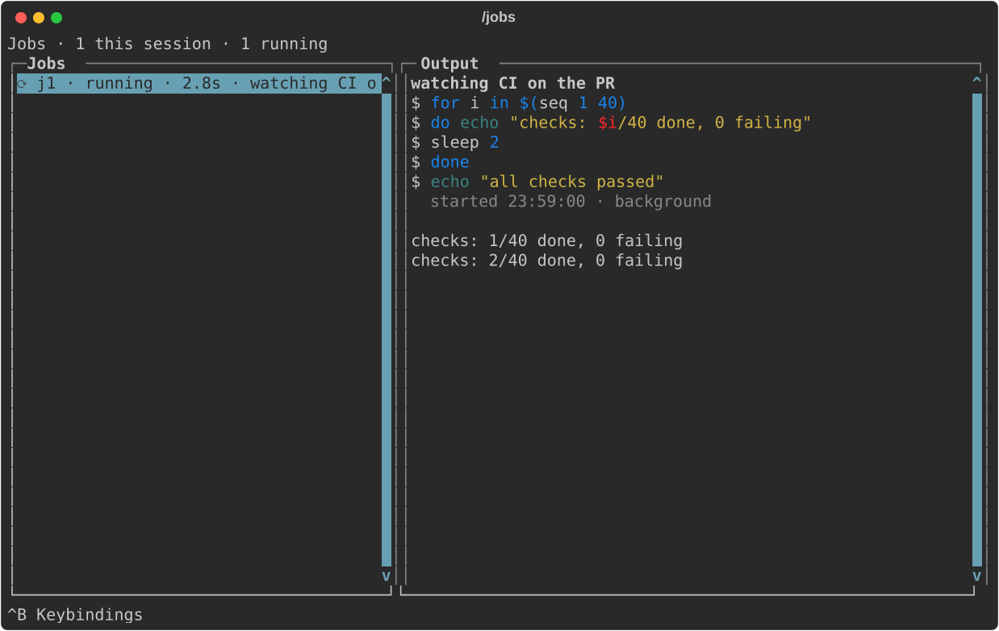

# A shell for long-running work

Most agents treat a slow command as a problem: they block on it, time out and
kill it, or poll it with `sleep`. pcode's shell treats slow commands as normal,
which makes it a good fit for work that lives in the terminal: CI runs, dev
servers, long test suites, deploys.

## What happens to a slow command

Every command the agent runs becomes a **job** with an id (`j1`, `j2`, …) that
keeps running whether or not anyone is waiting on it.

- If the agent waits on a command and it runs past the wait's timeout, the
  command isn't killed. The agent gets the job handle back and can do other
  work, check on it later, or wait again.
- The agent can start a command in the background deliberately, and wait for
  a line of output ("listening on port 3000") instead of the exit, which is
  what a server needs.
- When a job finishes, the agent is told. It doesn't poll, and it's told not to
  `sleep`.
- If the agent has already finished its turn, a job it started finishing
  **wakes it up**: a new turn starts on its own so it can act on the result.

You see running jobs as rows under the spinner:


`/jobs` lists them beside each one's live output. Ctrl+W pins a job's output
into the preview and Ctrl+K stops it. Jobs outlive the turn and even pcode: if
you quit with a job running, the next pcode adopts it.



## Example: watch CI and fix what fails

```text
❯ push this branch, watch the CI run, and fix whatever fails
```

The agent pushes, then starts `gh run watch` as a background job and ends its
turn. You're free to keep working or walk away. When the run finishes, the job
exit wakes the agent. If CI is green it tells you; if not, it reads the failed
job's log, fixes the problem, pushes again and watches the new run.

The same pattern works for anything slow:

- "Start the dev server and check the signup flow in the browser." The server
  runs as a job, and the agent waits for its ready line before testing.
- "Run the full suite, and while it runs, write the release notes." The suite
  runs in the background while the agent writes.
- "Deploy to staging and tell me when the health check passes."

## Staying in control

- Typing a follow-up while the agent waits on a command ends the wait, not the
  command. In the default `steering` send mode your message reaches the agent
  right away, and the job keeps running.
- Ctrl+C means stop, so it also stops the command the turn was waiting on. A
  job the agent explicitly backgrounded keeps running; stop it from `/jobs`.
- `pcode config set job_wake off` turns off waking; the agent then hears about
  finished jobs at your next message.
- Stopping a job stops everything it started, so a server releases its port.

For the details, see [shell jobs](../tools.md#shell-jobs). To run a command
yourself without asking the agent, prefix it with `!` in the editor; see
[`!command`](../commands.md#running-a-command-yourself-command).
