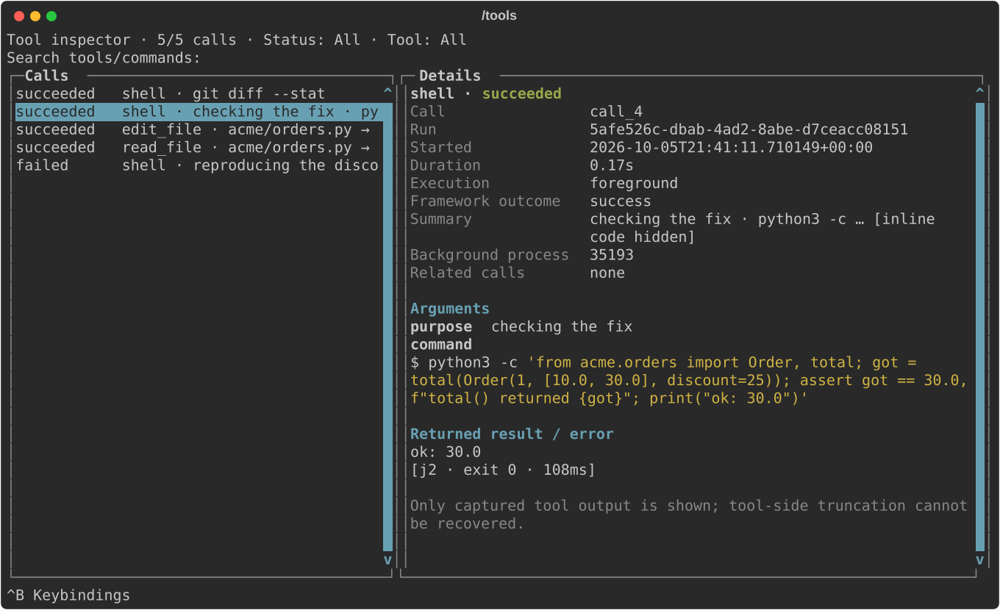
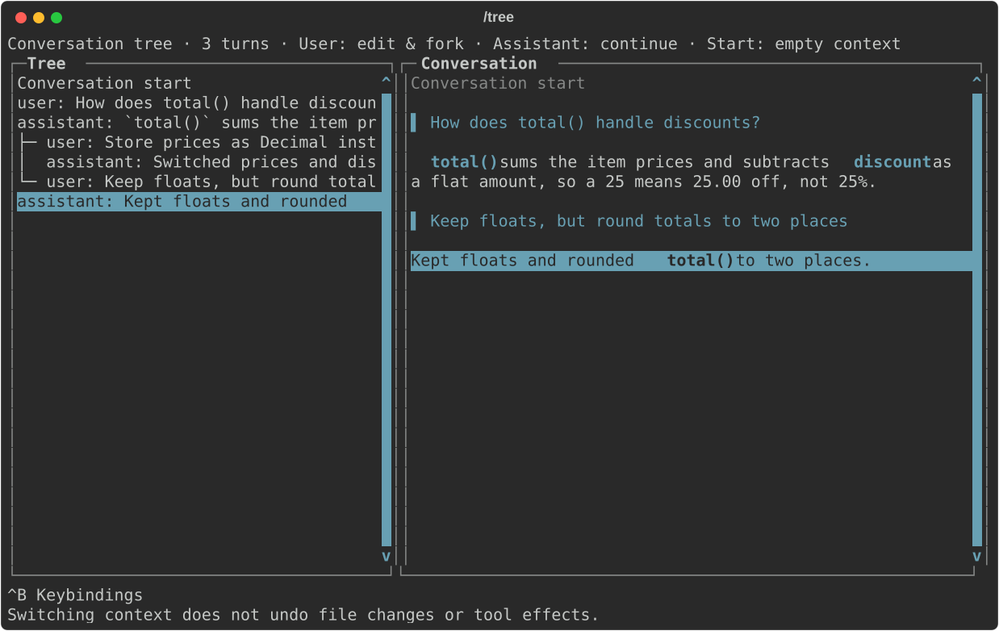
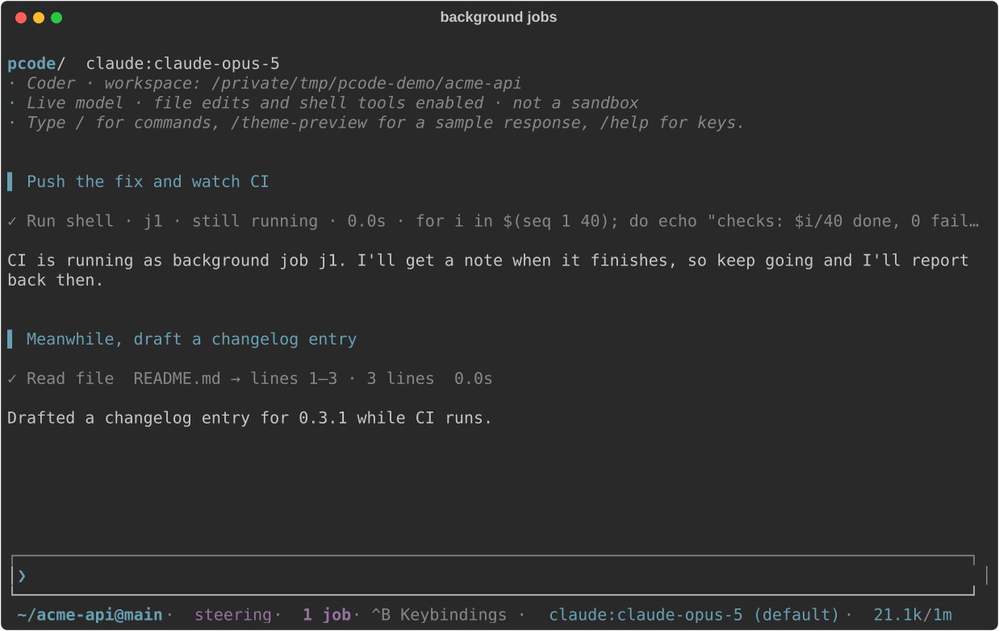

# pcode

pcode is a terminal-native coding agent built for long-running and parallel
work. Background commands wake the agent when they finish, every session can
use its own git worktree, conversations can be rewound and forked (in the style
of [pi](https://github.com/badlogic/pi-mono/blob/main/packages/coding-agent/docs/tree.md)),
and every tool call stays inspectable. It runs on any model
[Pydantic AI](https://ai.pydantic.dev/) supports, or on your ChatGPT or Claude
subscription (Claude through Anthropic's own Agent SDK and Claude Code login,
the route Anthropic supports).

```sh
brew tap cruxwell/pcode https://github.com/cruxwell/pcode.git
brew install cruxwell/pcode/pcode     # or: uv tool install 'pcode[claude]'
pcode -m claude:claude-sonnet-5        # or openai-codex:gpt-5.6-luna, or any API-key provider
```

!!! warning "Live mode edits files and runs commands"
    There is no approval prompt: the agent edits files and runs shell commands
    with your permissions. Read [tool permissions](tools.md#tool-permissions)
    before pointing it at anything you care about.

## It's just your terminal

There's no full-screen app. The model's replies, diffs and command output are
written into your terminal's normal scrollback, so everything you already use
keeps working: scroll with your mouse or tmux copy mode, search with your
terminal's find, select and copy text. Only the editor and the live activity
panel sit at the bottom and redraw.

## Scrollback you can change after the fact

Most terminal agents either print everything forever or hide it behind a UI.
pcode keeps the whole transcript and re-renders your scrollback whenever you
change what you want to see.

Watch every command and its output while a turn runs, then collapse the lot to
one-line summaries once you only care about the result. Or the other way round:
work with a quiet transcript and bring the details back when something looks
off. Every toggle rewrites the history already on screen, not just what comes
next.

| Toggle | What it does |
| --- | --- |
| Ctrl+G, `/show-commands` | Mirror each command and its output into scrollback, or hide them |
| `/show-edits` | Show or hide the diff of every file edit |
| `/show-thinking` | Show the model's reasoning on the status line, in scrollback, or not at all |
| `/group-tools` | Fold each run of tool calls into one line (on by default): `✓ 15 ✗ 1 tools · Edit file ✓ 10 · Run shell ✓ 5 ✗ 1` |
| Ctrl+O, `/show-tasks` | Show or hide the live task and tool panel |

Resizing the terminal re-renders at the new width too, so a narrowed pane
doesn't leave half-wrapped wreckage behind. Replay never reruns a tool. See
[scrollback and transparency](guide/scrollback.md).

## Nothing hidden: `/tools`

`/tools` opens every tool call the agent has made in this conversation, newest
first, including while a turn is still running: the exact command, its
arguments, how long it took, and the full output it returned. Filter to
failures with Ctrl+X, search by name or command, and copy a command (Ctrl+Y) or
its output (Ctrl+O) to run or paste yourself. It survives resume, so you can
audit what happened in a session from last week. See
[scrollback and transparency](guide/scrollback.md#every-command-nothing-hidden-tools).



## Rewind and fork with `/tree`

Every conversation is a tree, not a line. `/tree` shows it with the full branch
beside it; pick any earlier prompt to edit it and go a different way, or pick an
answer to jump back to that point. The branch you left stays there to return
to. It's inspired by [pi's session tree](https://github.com/badlogic/pi-mono/blob/main/packages/coding-agent/docs/tree.md),
which is the best idea in that agent.



See [conversation tree navigation](conversation-tree.md).

## A shell built for long-running work

The agent's shell treats slow commands as normal. A command the model chose to
wait on that runs past its timeout isn't killed: it turns into a background job
with an id, and the model gets the handle back and keeps working. Jobs can wait
for a readiness line (`listening on`) instead of exit, and their exits are
delivered to the model rather than polled for. If the model has finished its
turn, a job finishing wakes it up to act on the result.

That makes jobs a good fit for terminal-heavy work: watching a CI run and
fixing what fails, starting a dev server and testing against it, or running a
slow suite while editing something else. `/jobs` lists what's running and shows
each log; jobs even survive pcode restarting and are picked up by the next
session. See [a shell for long-running work](guide/shell.md).



## Your Claude subscription, the supported way

`claude:` models run through Anthropic's own
[Claude Agent SDK](https://docs.claude.com/en/api/agent-sdk/overview) and the
Claude Code login. Sign-in happens in Anthropic's flow, Claude Code holds and
refreshes the tokens, and pcode never sees them. Anthropic's
[terms](https://code.claude.com/docs/en/legal-and-compliance) allow signing in
to the unmodified Claude Code binary with your own subscription; they forbid
third-party apps that collect or hold Claude.ai credentials, which is what
most "use your Claude account" tools do.

```sh
pcode -m claude:claude-sonnet-5   # /login claude if Claude Code isn't signed in yet
```

ChatGPT subscriptions work the same way with `/login openai-codex`, and any
provider with an API key works too. Switch models mid-conversation with
Ctrl+L. See [providers and models](providers.md).

## Ask while it works: `/btw`

`/btw why did you pick a recursive descent parser?` asks a side question
about what the agent is doing without interrupting it. The answer runs in
parallel against the same context, pops up when it's ready, and never enters
the main conversation unless you choose to pull it in. See
[side questions](side-questions.md).

## Sessions that outlive the terminal

A session runs inside its terminal until you want it to outlive it: `/detach`
moves it into a background host. Then close the terminal and the turn keeps
going; `pcode --attach` picks it back up. `/switch` moves between running
sessions and Ctrl+^ flips back to the last one. Everything is saved, so
`pcode --continue` resumes the latest conversation in a directory and `/resume`
searches all of them. See [sessions and recovery](sessions.md).

## Ask about past sessions

You don't need to dig up an old session to use what's in it. Ask "what did we
decide about the retry logic last week?" and pcode searches your saved
conversations for this project (worktrees included), reads the relevant turns,
and answers with a pointer to where it found them. It also recovers details
from earlier in the current conversation that compaction dropped from context.
See [recalling earlier sessions](sessions.md#recalling-earlier-sessions).

## Run several agents on one repo

Two agents in one checkout step on each other: one runs `git checkout` or
`git stash` and the other's uncommitted edits are gone. With worktrees on,
every pcode session gets its own git worktree and branch under `.worktrees/`,
and that becomes its workspace. File tools, the shell and the saved session all
point there, so the agent needs no instructions and a relative path can't land
in your main checkout by accident.

```sh
pcode config project set worktree on   # every session in this repo gets a worktree
pcode --worktree fix-flaky-test        # or just this one, with a readable name
```

So you can have one session fixing a bug, another writing a feature and a
third reviewing a PR, all in the same repository at the same time. When a
session is done, `/worktree merge` merges your main branch into the worktree
first, so any conflicts get resolved there and never in your main checkout,
then fast-forwards main. Leaving a session with unmerged commits asks whether
to merge it. `/worktree clean` removes finished worktrees and lists any it kept
and why, so it can't lose work. A setup script can run in each new worktree to
install dependencies or copy untracked config like `.envrc`.

See [parallel agents](guide/parallel.md).

## Sub-agents in parallel, in plain sight

Inside one session the agent can split work across several workers running at
once: one per failing test, one per API handler, one per repository to survey.
Each starts with a clean context and its own plan, so the main conversation
only gets their results.

Sub-agents in most tools are a black box until they return. In pcode, the task
panel lists each running agent with its purpose, and `/agents` opens a live
view of all of them: each agent's assignment, plan, streamed text, every tool
call it makes, and its reasoning if you want it. Agents can run on a
different model from the parent (`/subagents`), and with `worker_isolation` on
each one edits in its own worktree and comes back as a branch to review. See
[parallel agents](guide/parallel.md#sub-agents-in-parallel).

## Hand it the browser

`/browser launch` gives the agent a Chrome window to drive: navigate, click,
type, screenshot, test your dev server on localhost. It runs with its own
profile, so sign-in pages like Google accept it, and sites you log in to stay
logged in for later sessions. When a page needs you to sign in, the agent
leaves it on screen and asks.

`/browser attach` joins the Chrome, Chromium or Edge you already have open
instead, logins and all, and works in a tab of its own. That's what makes "check
my email" or "file this in the tracker" possible, and it's also the risky mode:
the agent can act as every account that browser is signed in to. See
[the browser](tools.md#browser-per-conversation).

## Built on Pydantic AI

The agent underneath is a [Pydantic AI](https://ai.pydantic.dev/)
[Harness](https://pydantic.dev/docs/ai/harness/) coder: the same filesystem,
shell, sub-agent, planning, compaction, MCP and browser capabilities you'd use
in your own agent. pcode adds the terminal and the parts a library leaves to
you: MCP servers with OAuth sign-in and deferred tool search, saved sessions you
can search, fork and ask about, background jobs, a worktree per session,
observable sub-agents, and subscription sign-in. Any model Pydantic AI supports
works with `--model` (and so do your Claude Code and ChatGPT subscriptions,
through their own sign-in flows), and an extension is a Pydantic AI capability,
so there's nothing pcode does that your own code can't hook into. See
[extending pcode](guide/extending.md).

## Make it yours

An extension is one Python file that can add slash commands, tools, guardrails
on tool calls, or extra instructions, and `/reload` picks up changes without a
restart. Skills in your repository become slash commands. There are themes, vi
mode, a configurable shortcut prefix, and per-repository settings. See
[extending pcode](guide/extending.md).

## Where to go next

- [Getting started](getting-started.md): install, sign in, first session.
- Guide: [scrollback and transparency](guide/scrollback.md),
  [a shell for long-running work](guide/shell.md),
  [parallel agents](guide/parallel.md), [extending pcode](guide/extending.md).
- Reference: [providers and models](providers.md),
  [configuration](configuration.md), [commands and keys](commands.md),
  [tools](tools.md), [MCP servers](mcp.md),
  [working in a repository](workspace.md), [sessions](sessions.md),
  [conversation tree](conversation-tree.md),
  [side questions](side-questions.md),
  [context, limits and caching](context.md), [the transcript](transcript.md).

Working on pcode itself? The contributor notes live in
[`dev/`](https://github.com/cruxwell/pcode/tree/master/dev) in the repository.
